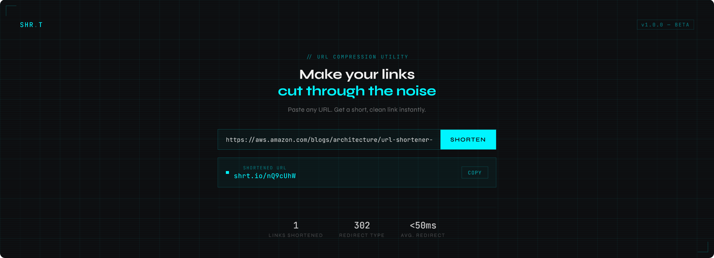

# URL Shortener — Project Specification
> Master reference for Claude Code. Read this file in full before generating any code, scaffolding, or infrastructure.

---

## 1. Project Overview

A production-quality URL shortener built on AWS serverless infrastructure. Designed as a backend engineering portfolio piece with interview-scale system design. The application is fully functional and deployed — not a toy.

**Domain setup (placeholder — replace with your actual domain name when chosen):**
- Single `.io` domain strategy — one domain, two purposes:
  - `www.myapp.io` — the frontend where users create short links
  - `myapp.io/{code}` — the short link redirect path
- Both routes handled by Route 53, split to CloudFront (frontend) and API Gateway (short links)
- Set actual domain via environment variables at deploy time — no hardcoded domain in code

**Scale:** Small personal project (~10 users) but architected and implemented as if it could scale to millions.

---

## 2. Functional Requirements (MVP)

1. Users can submit a long URL and receive a shortened URL in return.
2. Users can visit a shortened URL and be redirected to the original destination.
3. Shortened links automatically expire 7 days after creation (fixed default, not user-configurable in MVP).

> Future iterations (do NOT implement in MVP): custom aliases, user-configurable expiration (up to 30 days max), click analytics dashboard, user accounts/auth, link deletion, link listing.

---

## 3. API Design

### Endpoints

| Method | Path | Description |
|--------|------|-------------|
| `POST` | `/shorten` | Accept a long URL, return a short code and full short URL |
| `GET` | `/{code}` | Look up the short code, return HTTP 302 redirect to original URL |

### POST /shorten

**Request body:**
```json
{
  "long_url": "https://www.amazon.com/some/very/long/product/link"
}
```

**Response (201 Created):**
```json
{
  "short_code": "x7k2p",
  "short_url": "https://myapp.io/x7k2p",
  "long_url": "https://www.amazon.com/some/very/long/product/link",
  "created_at": "2026-06-06T12:00:00Z",
  "expires_at": "2026-06-13T12:00:00Z"
}
```
> `expires_at` is now always populated — 7 days after `created_at` — per the fixed MVP expiration policy (Section 15).

**Validation:**
- Reject null/empty URLs
- Reject malformed URLs (must be valid HTTP/HTTPS)
- Return `400 Bad Request` with descriptive error message on invalid input

### GET /{code}

**Success:** `302 Found` with `Location` header set to the original long URL.

> **Important:** Must be 302 (temporary), NOT 301 (permanent). 301 causes browsers to cache the redirect, bypassing the server on subsequent clicks and breaking future analytics.

**Not found:** `404 Not Found` if the short code does not exist in the database.

---

## 4. Tech Stack

### Backend
- **Language:** Java 21
- **Framework:** Spring Boot 3.x
- **Build tool:** Gradle (Kotlin DSL — `build.gradle.kts`)
- **Deployment:** AWS Lambda via Spring Cloud Function or `aws-serverless-java-container`
- **Key dependencies:**
  - `spring-boot-starter-web`
  - `spring-boot-starter-validation` (for URL validation)
  - `software.amazon.awssdk:dynamodb` (AWS SDK v2)
  - `software.amazon.awssdk:dynamodb-enhanced`
  - `spring-data-redis` + `lettuce-core` (for ElastiCache/Redis)
  - `software.amazon.awssdk:sqs` (AWS SDK v2 SQS — analytics pipeline)
  - `aws-serverless-java-container-springboot3` (Lambda adapter)

### Frontend
- **Framework:** React 18 + TypeScript
- **Build tool:** Vite
- **Styling:** Tailwind CSS + shadcn/ui
- **HTTP client:** Axios or native fetch
- **Deployment:** AWS S3 + CloudFront

### Frontend Design Approach
- AI-generated via v0 (Vercel) for initial component scaffolding, then refined in Claude Code
- Design aesthetic: **lo-fi / cyberpunk** — dark background, neon accent colors, monospace typography, subtle grid/scanline texture. Distinctive and memorable, not generic AI purple-gradient-on-white.
- Avoid: Inter, Roboto, Arial, generic purple gradients, cookie-cutter layouts
- Use: CSS variables for theming, micro-animations, cohesive dark palette with sharp accent color

### Infrastructure (AWS)
- **IaC tool:** Terraform — manages all core application infrastructure (see Section 19)
- **Manually provisioned (console):** domain registration, ACM certificate, AWS Budget alert — see Section 19.2 for full rationale
See Section 6 for full architecture details.

---

## 5. Short Code Generation

- **Length:** 7 characters (alphanumeric: `[a-zA-Z0-9]`)
- **Strategy:** Generate random 7-char code → check DynamoDB for collision → retry if collision found (collision probability is negligible at this scale)
- **Algorithm:** `Base62` encoding or `SecureRandom` against a 62-char alphabet
- **Do NOT use:** Sequential IDs (guessable), UUIDs (too long)

---

## 6. AWS Architecture

### Services Used

| Service | Purpose | VPC Required |
|---------|---------|--------------|
| Route 53 | DNS routing for both domains | No |
| CloudFront | CDN + HTTPS termination for frontend | No |
| S3 | Static frontend file hosting | No |
| API Gateway | Public HTTP entry point for backend | No |
| Lambda: shorten | Handles POST /shorten | No |
| Lambda: redirect | Handles GET /{code}, VPC-attached | **Yes** |
| DynamoDB | Persistent URL mapping storage | No |
| ElastiCache (Redis) | In-memory cache for hot short codes | **Yes** |
| SQS | Click event queue for async analytics | No |
| Lambda: analytics | Consumes SQS events, writes click data | No |

### VPC Notes
- **ElastiCache requires a VPC** (private subnet). This is the only reason a VPC exists in this architecture.
- **Lambda: redirect must be VPC-attached** to reach ElastiCache. This adds a small cold-start latency penalty (~ms).
- **Internet Gateway** is present in the VPC but unused — no public internet traffic ever enters the VPC. Only internal AWS traffic (Lambda → ElastiCache) flows through the private subnet.
- Lambda: shorten and Lambda: analytics run **outside the VPC**.

> ⚠️ **Real gap identified during `vpc.tf` implementation (Step 12b):** once `λ redirect` is VPC-attached, its security group (Section 16.8) is scoped to outbound port 6379 to ElastiCache *only*. But `λ redirect` also calls DynamoDB (on cache miss) and SQS (fire-and-forget analytics per Section 17.3/17.9) — those calls will be silently blocked at the network layer once the Lambda is actually deployed inside the VPC, since nothing currently allows that outbound traffic. **Fix: add VPC Endpoints for DynamoDB and SQS** (not a NAT Gateway — that's for general internet access and costs continuously; this project only needs specific AWS service reachability, which VPC Endpoints provide privately and without ongoing NAT cost). Must be resolved in Terraform (likely a new `vpc_endpoints.tf`, or added to `vpc.tf`) before `lambda.tf` is written and `λ redirect` is actually deployed — otherwise it will appear to deploy successfully but hang/fail on every DynamoDB/SQS call at runtime.

### Traffic Flows

**Loading the frontend:**
```
User → Route 53 (www.myapp.io) → CloudFront → S3
```

**Shortening a URL:**
```
User (browser) → API Gateway → Lambda: shorten → DynamoDB
```

**Clicking a short link:**
```
User → Route 53 (myapp.io/{code}) → API Gateway → Lambda: redirect
  → ElastiCache (cache hit → 302 redirect immediately)
  → DynamoDB (cache miss → 302 redirect → write to ElastiCache)
  → SQS (async, fire-and-forget → λ analytics → click-events DynamoDB table)
```

### Lambda Handler Wiring

> ⚠️ **Gap identified before writing `lambda.tf` (Step 12b):** `aws-serverless-java-container-springboot3` is present in `build.gradle.kts`, but no class in the codebase actually implements the handler interface it requires. `AnalyticsEventConsumer` is a `Consumer<String>` (Spring Cloud Function shape) but has no AWS-specific entry point wired up either. Both need to be added before `lambda.tf`'s `handler` attribute can reference real, compiled classes.

**λ shorten and λ redirect — same JAR, same handler class, two separate Lambda function resources:**
- Both are HTTP-triggered through the same Spring Boot app, so they share one deployment package and one handler class implementing `RequestStreamHandler` (from `aws-lambda-java-core`), wrapping `SpringBootLambdaContainerHandler` from `aws-serverless-java-container-springboot3`.
- They exist as **two separate Lambda function resources** (not one) because **VPC attachment is a per-function setting** — only `redirect` needs it (for ElastiCache). Keeping `shorten` non-VPC-attached avoids the VPC cold-start penalty it doesn't need.
- API Gateway routes `POST /shorten` to the shorten function's ARN and `GET /{code}` to the redirect function's ARN — same underlying code, different function identity and different network configuration.

**λ analytics — different trigger, different handler shape:**
- SQS-triggered, not HTTP-triggered. Needs `aws-lambda-java-events` (not yet in `build.gradle.kts`) and a class implementing `RequestHandler<SQSEvent, Void>`, which wraps the existing `AnalyticsEventConsumer.accept(String)` for each record in the batch.

**New `build.gradle.kts` dependencies needed:**
```kotlin
implementation("com.amazonaws:aws-lambda-java-core")
implementation("com.amazonaws:aws-lambda-java-events")
```

> ⚠️ **Second gap, identified while scoping `lambda.tf` (Step 12b):** all three Lambda functions boot the **entire** Spring Boot application context, not just the beans each one needs — `StreamLambdaHandler` wraps the whole app for shorten/redirect, and `AnalyticsLambdaHandler`'s `WebApplicationType.NONE` context still creates every bean, it just skips starting a web server. Two consequences:
>
> 1. **`app.dynamodb.click-events-table-name` and `app.sqs.queue-url` have no defaults in `application.yml`.** If any function's environment variables omit them, Spring Boot fails to start entirely on cold start — not a functional gap, a total crash. Since `shorten` boots the full context (including `AnalyticsService`, which requires `SQS_QUEUE_URL`), it needs every required property set even though it never functionally uses SQS or the click-events table.
> 2. **`shorten` isn't VPC-attached but still constructs `RedisConfig`'s connection factory**, pointed at a Redis endpoint only reachable from inside the VPC. Risk of a hang/failure on cold start depending on connection eagerness.
>
> **Fixes:** (a) add `spring.main.lazy-initialization: true` to `application.yml` so beans are only created on first actual use — neutralizes the Redis risk since `shorten` never calls `cacheRepository`; (b) give **all three** Lambda functions in `lambda.tf` the identical, full set of app environment variables, even ones a given function doesn't functionally use, since Spring requires every referenced property to resolve at startup regardless of which function is running.

> ⚠️ **Third gap, identified before writing `api_gateway.tf`:** `StreamLambdaHandler` uses `SpringBootLambdaContainerHandler.getAwsProxyHandler(...)`, which expects the **API Gateway REST API (v1) proxy event format**. A modern HTTP API (v2) with its default `payload_format_version = "2.0"` sends a differently-shaped event that this handler cannot parse — every request would fail despite correct IAM/networking/handler wiring. **Fix:** use HTTP API (v2) for its simplicity/cost, but explicitly set `payload_format_version = "1.0"` on both Lambda integrations, which makes HTTP API v2 emit the older, REST-API-v1-shaped event `StreamLambdaHandler` already expects.
>
> **CORS is not configured at the API Gateway layer** — `UrlController`'s existing, tested `@CrossOrigin` annotation already handles CORS entirely in Spring (Section 16.3). Configuring it a second time at API Gateway risks conflicting behavior between the two layers.

### Caching Strategy
- **Pattern:** Cache-aside (lazy loading)
- **Cache population:** On first cache miss, load from DynamoDB and write to Redis
- **TTL:** Set a reasonable expiry (e.g. 24h) on Redis entries so stale/dead links don't persist in memory
- **Cache hit:** Return immediately, skip DynamoDB entirely
- **Cache miss:** Hit DynamoDB, populate cache, return result

### DynamoDB Table Design

**Table name:** `url-mappings`

**Primary key:** `short_code` (String, partition key)

**Attributes:**
```
short_code  (String)  — partition key, e.g. "x7k2p"
long_url    (String)  — the original full URL
created_at  (String)  — ISO 8601 timestamp
expires_at  (String)  — ISO 8601 timestamp, nullable (null = no expiry)
```

**Access pattern:** Always a single key lookup by `short_code`. No GSIs needed for MVP.

**Billing mode:** On-demand (PAY_PER_REQUEST) — no capacity planning needed at this scale, and cost is effectively zero.

---

### DynamoDB Table Design — click-events

**Table name:** `click-events`

**Primary key:** Composite key
- Partition key: `short_code` (String)
- Sort key: `clicked_at` (String — ISO-8601 timestamp)

**Attributes:**
```
short_code   (String) — which link was clicked, partition key
clicked_at   (String) — ISO-8601 timestamp, sort key
```

**Access pattern:** Query all clicks for a specific short code ordered by time (useful for V2 analytics dashboard).

**Billing mode:** On-demand (PAY_PER_REQUEST)

---

## 7. Project Structure

```
url-shortener/
├── backend/                          # Spring Boot Java application
│   ├── src/
│   │   ├── main/
│   │   │   ├── java/com/urlshortener/
│   │   │   │   ├── UrlShortenerApplication.java
│   │   │   │   ├── controller/
│   │   │   │   │   └── UrlController.java              # REST endpoints
│   │   │   │   ├── service/
│   │   │   │   │   ├── UrlService.java                 # Core business logic
│   │   │   │   │   ├── AnalyticsService.java           # SQS click event publisher
│   │   │   │   │   └── AnalyticsEventConsumer.java     # SQS consumer, writes click data
│   │   │   │   ├── repository/
│   │   │   │   │   ├── DynamoDbRepository.java         # DynamoDB access (url-mappings)
│   │   │   │   │   └── CacheRepository.java            # Redis/ElastiCache access
│   │   │   │   ├── model/
│   │   │   │   │   ├── UrlMapping.java                 # DynamoDB entity (url-mappings table)
│   │   │   │   │   └── ClickEvent.java                 # DynamoDB entity (click-events table)
│   │   │   │   ├── dto/
│   │   │   │   │   ├── ShortenRequest.java             # POST /shorten request body
│   │   │   │   │   └── ShortenResponse.java            # POST /shorten response body
│   │   │   │   ├── config/
│   │   │   │   │   ├── DynamoDbConfig.java             # DynamoDB client bean
│   │   │   │   │   ├── RedisConfig.java                # Redis/ElastiCache client bean
│   │   │   │   │   └── SqsConfig.java                  # SQS client bean
│   │   │   │   ├── util/
│   │   │   │   │   └── ShortCodeGenerator.java         # Base62 code gen
│   │   │   │   └── exception/
│   │   │   │       ├── GlobalExceptionHandler.java     # Centralized error mapping
│   │   │   │       ├── InvalidUrlException.java        # 400 Bad Request
│   │   │   │       └── NotFoundException.java          # 404 Not Found
│   │   │   └── resources/
│   │   │       └── application.yml
│   │   └── test/
│   └── build.gradle.kts
│
├── frontend/                         # React + TypeScript application
│   ├── src/
│   │   ├── components/
│   │   │   ├── UrlForm.tsx           # Main shorten form
│   │   │   └── ResultCard.tsx        # Displays the shortened URL
│   │   ├── services/
│   │   │   └── api.ts                # API calls to backend
│   │   ├── App.tsx
│   │   ├── main.tsx
│   │   └── index.css
│   ├── index.html
│   ├── vite.config.ts
│   ├── tailwind.config.ts
│   └── package.json
│
├── infrastructure/                   # AWS IaC (Terraform) — see Section 19
│   ├── main.tf                       # AWS provider config, remote state (commented, local for now)
│   ├── variables.tf                  # aws_region, environment
│   └── outputs.tf                    # Placeholder — table names, endpoint URLs added as resources are created
│
└── PROJECT_SPEC.md                   # This file
```

---

## 8. Environment Variables / Config

### Backend (application.yml / Lambda env vars)
```
AWS_REGION=us-east-1
DYNAMODB_TABLE_NAME=url-mappings
DYNAMODB_CLICK_EVENTS_TABLE_NAME=click-events
REDIS_HOST=<elasticache-endpoint>
REDIS_PORT=6379
BASE_SHORT_URL=https://myapp.io
SQS_QUEUE_URL=<sqs-queue-url>
FRONTEND_ORIGIN=https://www.myapp.io
LINK_EXPIRATION_DAYS=7
```

### Frontend (.env)
```
VITE_API_BASE_URL=https://api.myapp.io
```

---

## 9. Error Handling

| Scenario | HTTP Status | Response |
|----------|------------|----------|
| Valid request | 201 / 302 | See API section |
| Invalid / malformed URL | 400 | `{ "error": "Invalid URL format" }` |
| Missing request body | 400 | `{ "error": "long_url is required" }` |
| Short code not found | 404 | `{ "error": "Short code not found" }` |
| Internal server error | 500 | `{ "error": "Internal server error" }` |

---

## 10. What to Scaffold First (Implementation Order)

Claude Code should scaffold in this order:

1. **Backend project skeleton** — Spring Boot 3 + Gradle, all dependencies in `build.gradle.kts`, `application.yml` with placeholder config, package structure as defined in Section 7
2. **Data models** — `UrlMapping`, `ShortenRequest`, `ShortenResponse`
3. **ShortCodeGenerator utility** — Base62, 7 characters, collision-safe
4. **DynamoDB repository** — CRUD using AWS SDK v2 enhanced client
5. **Redis cache repository** — get/set with TTL using Spring Data Redis
6. **UrlService** — business logic: cache-aside lookup, code generation, persistence
7. **UrlController** — REST endpoints, validation, error handling
8. **GlobalExceptionHandler** — `@ControllerAdvice` for consistent error responses
9. **SQS analytics pipeline** — implement async click tracking. See Section 6 and new Section 17 for full details. Files: `SqsConfig.java`, `AnalyticsService.java`, `AnalyticsEventConsumer.java`. Update `UrlService.redirect()` to fire-and-forget to SQS. Add `click-events` DynamoDB table schema. Add SQS dependency to `build.gradle.kts`.
10. **Unit tests** — write tests for ShortCodeGenerator, DynamoDbRepository, CacheRepository, UrlService, UrlController, and AnalyticsService before moving to infrastructure. Pragmatic choice: getting deployed end-to-end teaches more than perfect coverage at this stage, so tests are batched after all backend classes are complete rather than written class-by-class. **STATUS: COMPLETE.**
10b. **Link expiration (fixed 7-day MVP default)** — added to scope after Step 10. See Section 15 for full details. Update `UrlService.shorten()` to set a real `expiresAt`, update `UrlService.redirect()` to check expiry, add `app.link.expiration-days` config. Update the existing `UrlServiceTest` test that asserts null `expiresAt`, add a new test for the expired-link 404 case.
11. **CI/CD pipeline (build + test only)** — `.github/workflows/backend.yml` that builds and runs tests on every push. No deploy step yet — infrastructure does not exist at this point. See Section 14.
12. **AWS infrastructure provisioning** — split into four parts. See Section 19 for full details.
    - 12a. **Console orientation** — manually create and delete one simple resource (e.g. a DynamoDB table) in the AWS Console to build a mental model before writing Terraform.
    - 12b. **Terraform-managed infrastructure** — Lambda functions (shorten, redirect, analytics; **requires actual Lambda handler classes to exist first — see Section 6's "Lambda Handler Wiring" subsection, a gap identified before this step**), API Gateway, DynamoDB tables (url-mappings + click-events), ElastiCache + VPC + private subnets + security groups, SQS queue, S3 bucket, CloudFront, IAM roles.
    - 12c. **Console-managed (manual, one-off)** — Route 53 domain registration, ACM certificate request + validation, AWS Budget alert.
    - 12d. **CloudWatch monitoring & alarms (minimal MVP scope)** — added after 12b, since it requires Lambda and API Gateway to already exist. See new Section 20 for full details. Not deferred to V2 — deploying without any failure notification was identified as a real production gap, not a nice-to-have.
13. **Wire CI/CD deploy step** — now that infrastructure exists, add the Lambda deploy step to `backend.yml` and create `frontend.yml` with S3 sync + CloudFront cache invalidation. From this point every push to main auto-deploys.
14. **Frontend scaffold** — Vite + React + TS + Tailwind + shadcn/ui, lo-fi/cyberpunk aesthetic, UrlForm and ResultCard components wired to the real deployed API. See Section 11.
15. **End-to-end verification** — manually test the full flow: shorten a URL via the frontend, click the short link, confirm 302 redirect works, confirm DynamoDB record exists, confirm Redis cache is populated, confirm click event appears in click-events table.

---

## 11. Frontend Design Directive (for Claude Code)

**Reference mockup:**



> The file [`assets/url_shortener_cyberpunk_mockup.html`](assets/url_shortener_cyberpunk_mockup.html)
> contains the full interactive HTML mockup. Use it as the **exact design reference** 
> when building the frontend. The full interactive HTML design reference to be used as the exact visual target
> when scaffolding the frontend — extract colors, fonts, layout, and component structure directly from it.

When generating the frontend, commit to a **lo-fi cyberpunk** aesthetic:
- Dark background (`#0d0d0f` or similar near-black)
- Neon accent color (green `#39ff14` or cyan `#00f5ff` — pick one and commit)
- Monospace font for code/URLs (e.g. `JetBrains Mono`, `IBM Plex Mono`)
- Clean sans-serif for UI text (e.g. `Syne`, `DM Sans`) — NOT Inter or Roboto
- Subtle scanline or grid texture overlay on the background
- Sharp borders, no rounded corners on primary elements
- Micro-animation on form submit (loading state, result reveal)
- Single-page layout — hero section with the form, result displayed inline
- Mobile responsive

---

## 12. Key Design Decisions & Rationale

| Decision | Choice | Why |
|----------|--------|-----|
| Redirect type | 302 | Prevents browser caching; every click hits the server for analytics |
| Short code length | 7 chars Base62 | ~3.5 trillion combinations; collision-proof at any realistic scale |
| Database | DynamoDB | Key-value lookups by short_code; no relational data; scales automatically |
| Cache | ElastiCache Redis | In-memory; dramatically faster than DynamoDB for hot links |
| Cache pattern | Cache-aside | Only cache what's actually accessed; no wasted memory |
| Compute | Lambda | Serverless; scales to zero; effectively free at personal project scale |
| VPC | Minimal (ElastiCache only) | ElastiCache requires VPC; everything else runs outside it |
| Billing | DynamoDB on-demand | No capacity planning; ~$0 at this scale |

---

## 13. Out of Scope for MVP

The following are **planned future iterations** — do NOT implement or scaffold:
- User authentication / accounts
- Custom aliases
- User-configurable link expiration (up to 30 days max) — fixed 7-day default IS implemented in MVP, see Section 15
- Click analytics dashboard
- `GET /links` (list all links)
- `DELETE /links/{code}`
- `PATCH /links/{code}`
- SQS analytics pipeline — moved to MVP scope, implemented in Step 9. See Section 17.
- ~~Terraform / CDK infrastructure as code~~ — MOVED INTO SCOPE. See Section 19.
- CloudWatch Dashboards, anomaly detection, Slack/PagerDuty integration — genuinely deferred. **Basic CloudWatch Alarms (Lambda errors, API Gateway 5xx, DynamoDB throttling) via SNS email ARE in MVP scope** — see Section 20. Deploying with zero failure notification was judged a real production gap, not a nice-to-have.


---

## 14. CI/CD Pipeline

### When to set it up
CI/CD is set up **after all backend classes and unit tests are written, but before AWS infrastructure is provisioned**. This is the optimal point because:

- The pipeline needs something real to build and test — setting it up before any code exists is premature
- Tests must exist before CI/CD is meaningful — a pipeline with no tests only checks compilation
- Infrastructure must not exist yet when CI/CD is first created — the build+test workflow goes in first, then the deploy step is added once infrastructure is provisioned in step 11

This means every infrastructure resource gets a fully automated, tested deployment pipeline from the moment it goes live. No manual deployments ever.

### Recommended: GitHub Actions

Since the project lives on GitHub, GitHub Actions is the natural fit — free for public repos, no external service needed, and deeply integrated with the repo.

### Pipeline Stages

**Backend (on every push to `main` and on every PR):**
```
Push / PR → Checkout → Set up Java 21 → Gradle build → Run tests → Build Lambda JAR → (on main only) Deploy to AWS Lambda
```

**Frontend (on every push to `main` and on every PR):**
```
Push / PR → Checkout → Node setup → npm install → TypeScript check → Vite build → (on main only) Upload dist/ to S3 → Invalidate CloudFront cache
```

### Files to create at scaffold time
```
.github/
└── workflows/
    ├── backend.yml    # Java build, test, Lambda deploy
    └── frontend.yml   # Node build, S3 deploy, CloudFront invalidation
```

### Required GitHub Secrets
These get stored in GitHub repo Settings → Secrets and must be configured before the deploy steps work:
```
AWS_ACCESS_KEY_ID
AWS_SECRET_ACCESS_KEY
AWS_REGION
LAMBDA_FUNCTION_NAME_SHORTEN
LAMBDA_FUNCTION_NAME_REDIRECT
S3_BUCKET_NAME
CLOUDFRONT_DISTRIBUTION_ID
```

### Branches
- `main` — production. Every merge triggers a full build + deploy.
- Feature branches — PRs trigger build + test only, no deploy.

### What CI/CD does NOT cover in MVP
- Staging / preview environments
- Integration tests against live AWS resources
- Automated rollback on failed deploy
- Infrastructure provisioning (Terraform) — that remains manual for now

---

## 15. Link Expiration / TTL Implementation

> **MVP scope.** Every shortened link automatically expires **7 days after creation** — fixed default, not user-configurable. User-configurable expiration (up to 30 days max) is a documented V2 feature (see Section 13).

### Why 7 days, and why fixed-not-configurable for MVP

- Long enough that demo links, links shared in conversations, and portfolio/interview links won't die mid-use
- Short enough to genuinely exercise the TTL mechanics end-to-end rather than never actually testing expiration
- Standard URL shorteners default to permanent links — a fixed expiration is a deliberate scope decision here, not an oversight, and is documented as such
- User-configurable expiration requires a new `POST /shorten` request field, new validation, and API contract changes — reasonable scope for V2, not MVP

### Configuration

The expiration duration is set via environment variable, never hardcoded:

```
LINK_EXPIRATION_DAYS=7
```

`application.yml`:
```yaml
app:
  link:
    expiration-days: ${LINK_EXPIRATION_DAYS:7}
```

Changing the MVP default later (or eventually replacing it with per-request user choice in V2) is a config change, not a code change.

### How it works across the stack

**Application logic sets the expiration at creation time.**
In `UrlService.shorten()`, `expiresAt` is calculated and stored as an ISO-8601 timestamp 7 days from creation, rather than always being `null`:

```java
Instant expiresAt = Instant.now().plus(linkExpirationDays, ChronoUnit.DAYS);
UrlMapping mapping = new UrlMapping(shortCode, longUrl, createdAt, expiresAt.toString());
```

**Application logic checks expiration at redirect time.**
In `UrlService.redirect()`, after fetching the mapping (from cache or DB), check if it's expired before returning the long URL:

```java
if (mapping.getExpiresAt() != null
        && Instant.now().isAfter(Instant.parse(mapping.getExpiresAt()))) {
    throw new NotFoundException("Short code not found"); // expired link = not found
}
```

An expired link returns the same 404 as a nonexistent one — the caller can't distinguish "never existed" from "existed but expired," which is intentional (no information leakage).

**Redis TTL — built-in, no custom logic needed, already implemented.**
The cache layer already uses a 24-hour TTL (Section 6, `CacheRepository`) — this is independent of link expiration and does not need to change. A cached entry may need to be re-validated against `expires_at` after a cache hit, since Redis doesn't know about the link's actual expiration, only its own 24h cache lifetime.

> ⚠️ **Important implementation detail:** because Redis caches only the long URL string (not the full `UrlMapping` with its `expires_at` field), a cache hit currently has no way to check expiration. Either (a) also cache the `expires_at` value alongside the long URL, or (b) accept that a cache hit within the 7-day window always succeeds and expiration is only enforced on cache misses (DynamoDB reads). Option (b) is acceptable for MVP since Redis TTL is 24h — worst case, a link expires and is still servable from cache for up to 24h after its actual expiration. Document this as a known MVP limitation.

**DynamoDB TTL — built-in, enable at the table level via Terraform (Step 12).**
DynamoDB has a native TTL feature. Designate `expires_at` as the TTL attribute, store a **Unix epoch timestamp** in it (not the ISO-8601 string used elsewhere — this is a DynamoDB-specific requirement), and DynamoDB automatically deletes the item within ~48 hours of that timestamp passing. This is configured once at the table level in Terraform — no scheduled jobs, no delete logic in application code.

> **Note:** this means `expires_at` needs to support being read as both an ISO-8601 string (for the application-level check above) and being usable as a Unix epoch number for DynamoDB's native TTL attribute. Confirm during implementation whether to store it as epoch seconds directly (simpler for DynamoDB TTL, requires conversion for display) or keep ISO-8601 and rely solely on the application-level check without enabling DynamoDB's native TTL attribute for MVP. Either is valid — decide during Step 12 when the table is actually provisioned.

This guard exists because DynamoDB TTL deletion has up to a 48h delay — an item can still be returned by a query even after its TTL timestamp has passed. The application must enforce expiry at the code level regardless of whether native DynamoDB TTL is also enabled.

### Summary

| Layer | Mechanism | Custom code? |
|-------|-----------|--------------|
| Application (create) | Set `expires_at` = now + 7 days | Yes — `UrlService.shorten()` |
| Application (redirect) | Check `expires_at`, throw `NotFoundException` if past | Yes — `UrlService.redirect()`, ~3 lines |
| Redis | 24h cache TTL (unrelated, already implemented) | No — already done, known limitation noted above |
| DynamoDB | Native TTL attribute (optional for MVP, decide at Step 12) | No — enable at table level via Terraform if used |

### What Changes in Already-Written Code

This feature touches code that is already implemented, tested, and merged to `main`. The following need updates:

- `UrlService.shorten()` — set real `expiresAt` instead of `null`
- `UrlService.redirect()` — add expiry check before returning
- `UrlServiceTest.shortenReturnsResponseForValidUrl()` — currently asserts `expiresAt` is null; update to assert it's ~7 days in the future
- New test: `redirectThrowsWhenExpired()` — mapping with a past `expires_at` should throw `NotFoundException`
- `application.yml` — add `app.link.expiration-days`
- `PROJECT_SPEC.md` Sections 2, 3, 13 — already updated to reflect this


---

## 16. Security

> This section is **not optional**. The application is publicly deployed on the internet. Every item here must be implemented before the application is considered production-ready.

---

### 16.1 API Gateway Throttling

API Gateway has built-in rate limiting. Configure at the stage level to protect against abuse and runaway billing.

**Settings to apply:**
```
Default throttling:
  Rate:  50 requests/second
  Burst: 100 requests

Per-route overrides (optional but recommended):
  POST /shorten: 10 requests/second  (creation is more expensive)
  GET /{code}:   50 requests/second  (redirects should be fast)
```

This is configured in API Gateway → Stages → Default Route Throttling. No extra cost.

---

### 16.2 Input Validation (SSRF Protection)

Beyond rejecting malformed URLs, the shorten Lambda must block URLs that could be used in a **Server-Side Request Forgery (SSRF)** attack. SSRF is when an attacker submits an internal/private URL and your server makes a request to it on their behalf.

**Example attack:** Submitting `http://169.254.169.254/latest/meta-data/` would cause your Lambda to hit the AWS instance metadata endpoint, potentially leaking credentials.

**Block the following:**
```java
// Reject these schemes entirely
Disallow: file://, ftp://, javascript://, data://, vbscript://
Allow only: http://, https://

// Reject private/internal IP ranges
10.0.0.0/8        (private network)
172.16.0.0/12     (private network)
192.168.0.0/16    (private network)
127.0.0.0/8       (loopback)
169.254.0.0/16    (AWS metadata endpoint — critical to block)
::1               (IPv6 loopback)

// Reject localhost variants
localhost
127.0.0.1
0.0.0.0

// Enforce URL length limit
Max URL length: 2048 characters
```

**Validation order in ShortenService:**
1. Null/empty check
2. Length check (≤ 2048 chars)
3. Scheme check (must be http:// or https://)
4. URL format check (must parse as valid URL)
5. Host resolution + private IP range check

Return `400 Bad Request` with a generic message (`"Invalid URL"`) for all failures — do not reveal which specific check failed, as that gives attackers information.

---

### 16.3 CORS Configuration

CORS (Cross-Origin Resource Sharing) controls which domains are allowed to call your API from a browser. Without correct CORS config your frontend cannot call your backend. With overly permissive CORS any website on the internet can call your API.

**Configure on API Gateway:**
```
Access-Control-Allow-Origin:  https://www.myapp.io   ← frontend subdomain only, NOT *
Access-Control-Allow-Methods: GET, POST, OPTIONS
Access-Control-Allow-Headers: Content-Type
Access-Control-Max-Age:       86400
```

**Never use `*` as the Allow-Origin on a production API.** It allows any website to make requests to your endpoints on behalf of their users.

Also handle **OPTIONS preflight requests** — browsers send an OPTIONS request before POST requests to check CORS policy. API Gateway must respond to OPTIONS on all routes with the correct headers or your frontend calls will be blocked.

---

### 16.4 HTTPS Enforcement

All traffic must be encrypted in transit. Never serve anything over plain HTTP.

**CloudFront:**
- Set viewer protocol policy to **Redirect HTTP to HTTPS** — not "Allow Both"
- This ensures anyone who types `http://www.myapp.io` gets silently upgraded to HTTPS

**API Gateway:**
- HTTPS only by default — no action needed

**ACM (AWS Certificate Manager):**
- Provision a free SSL/TLS certificate via ACM for your domain
- Attach to CloudFront distribution and API Gateway custom domain
- ACM certificates auto-renew — no manual renewal needed

---

### 16.5 IAM Least Privilege

Each Lambda function gets its own IAM execution role with the **minimum permissions required and nothing more**. This limits blast radius if a function is ever compromised.

| Lambda | DynamoDB permissions | Other |
|--------|---------------------|-------|
| λ shorten | `dynamodb:GetItem`, `dynamodb:PutItem` (both on `url-mappings`) | `logs:CreateLogGroup`, `logs:CreateLogStream`, `logs:PutLogEvents` (CloudWatch, via `AWSLambdaBasicExecutionRole`) |
| λ redirect | `dynamodb:GetItem` (on `url-mappings`) | ElastiCache access via VPC security group (network-level, not IAM); `sqs:SendMessage` (on the click-events queue); VPC ENI permissions via `AWSLambdaVPCAccessExecutionRole` (`ec2:CreateNetworkInterface`, `ec2:DescribeNetworkInterfaces`, `ec2:DeleteNetworkInterface`); CloudWatch logging as above |
| λ analytics | `dynamodb:PutItem` (on `click-events`) | `sqs:ReceiveMessage`, `sqs:DeleteMessage`, `sqs:GetQueueAttributes` (on the click-events queue); CloudWatch logging as above |

> **Correction (verified against actual code, not just the original design):** `λ shorten` requires `dynamodb:GetItem` in addition to `PutItem` — `UrlService.shorten()` calls `ShortCodeGenerator.generateUnique(dynamoDbRepository::exists)`, and `exists()` performs a `getItem` read to check for short-code collisions before saving. The original table above only listed `PutItem`, which would have caused every shorten request to fail once real least-privilege IAM policies were enforced. Caught during Step 12 IAM provisioning, before any Terraform was written against it.
>
> Also added: every Lambda needs baseline CloudWatch Logs permissions to write logs at all (commonly granted via the AWS managed policy `AWSLambdaBasicExecutionRole`), and `λ redirect` specifically needs VPC networking permissions to attach to the VPC (via `AWSLambdaVPCAccessExecutionRole`), since it's the one VPC-attached function.

**Never:**
- Use `dynamodb:*` wildcard permissions
- Use your personal AWS root account credentials in Lambda
- Attach `AdministratorAccess` to any Lambda role

**DynamoDB resource policy:**
Restrict table access so only the three Lambda execution roles can interact with it. No other AWS principal should have access.

> ⚠️  **TODO (pre-production):** During initial development, the IAM user (`stephen-dev-local`) and CI/CD user use AWS managed `FullAccess` policies per service for convenience. Before considering this application production-ready, replace all managed `FullAccess` policies with custom least-privilege policies containing only the exact actions each user/role needs. Track this as a GitHub issue. Also see the pre-deploy checklist in Section 16.9.

---

### 16.6 Environment Variables & Secrets

**Never hardcode in source code:**
- AWS region, table names, Redis endpoint, any URLs or keys

**Lambda environment variables:**
- Stored encrypted at rest by AWS by default (AES-256)
- Set via Lambda console or IaC — never in code

**GitHub Actions secrets:**
- All AWS credentials used in CI/CD go in GitHub repo Settings → Secrets and variables → Actions
- Reference in workflow files as `${{ secrets.AWS_ACCESS_KEY_ID }}` — never paste values directly in YAML

**Local development:**
- Use a `.env` file locally (already in `.gitignore`)
- Never commit `.env` to Git under any circumstances
- If a secret is ever accidentally committed, treat it as compromised immediately — rotate it, don't just delete the file

---

### 16.7 AWS Budget Alert

Set this up **before deploying anything**. Protects against unexpected bills from attacks, misconfiguration, or runaway Lambda invocations.

**Setup:**
1. AWS Console → Billing and Cost Management → Budgets
2. Create a monthly cost budget
3. Set amount: **$10**
4. Add alert threshold: 80% of budget (~$8)
5. Add your email as the notification recipient

This is not a hard limit — AWS will not stop your services when the threshold is hit. It just emails you so you can investigate and respond before costs escalate further.

Also enable **AWS Cost Explorer** to get a visual breakdown of spend by service.

---

### 16.8 Security Group for ElastiCache

ElastiCache lives in a private subnet but still needs a security group to control which resources can connect to it.

**ElastiCache security group inbound rules:**
```
Type:       Custom TCP
Port:       6379  (Redis default port)
Source:     Security group of λ redirect only
```

This means only your redirect Lambda can reach Redis on port 6379. Nothing else — not other Lambdas, not the internet, nothing.

**λ redirect security group outbound rules:**
```
Type:       Custom TCP
Port:       6379
Destination: ElastiCache security group
```

This is the principle of least privilege applied at the network level — not just IAM permissions but actual network-level restrictions.

---

### 16.9 Security Checklist (Pre-Deploy)

Before going live, verify every item:

- [ ] API Gateway throttling configured (50 req/sec default, 10 req/sec on POST /shorten)
- [ ] SSRF protection implemented in ShortenService (scheme check, private IP block, length limit)
- [ ] CORS configured with explicit domain, not wildcard
- [ ] CloudFront set to redirect HTTP → HTTPS
- [ ] ACM certificate provisioned and attached
- [ ] Each Lambda has its own IAM role with minimum required permissions only
- [ ] No hardcoded credentials anywhere in codebase
- [ ] GitHub Actions secrets configured for all AWS credentials
- [ ] `.env` confirmed in `.gitignore` and never committed
- [ ] AWS Budget alert set at $10/month
- [ ] ElastiCache security group allows inbound 6379 from λ redirect only
- [ ] DynamoDB resource policy restricts access to Lambda roles only
- [ ] Replace all managed FullAccess IAM policies with custom least-privilege policies (dev user + CI/CD user + Lambda roles)


---

## 17. SQS Analytics Pipeline

> Added to MVP scope — implement after Step 8 (GlobalExceptionHandler) and before unit tests.

---

### 17.1 Overview

When a short link is clicked, the redirect Lambda fires a click event to SQS asynchronously (fire-and-forget). A separate analytics Lambda consumes the queue and writes the click record to a dedicated DynamoDB table. The redirect response is never delayed by this — the user gets their 302 immediately.

```
User clicks link
    → λ redirect → looks up URL → returns 302 (user is gone)
                 → drops message on SQS (async, non-blocking)
                         → λ analytics picks it up
                                 → writes to click-events table
```

---

### 17.2 New Files

| File | Location | Purpose |
|------|----------|---------|
| `SqsConfig.java` | `config/` | Builds `SqsClient` bean via AWS SDK v2 |
| `AnalyticsService.java` | `service/` | Publishes click event JSON to SQS |
| `AnalyticsEventConsumer.java` | `service/` | Consumes SQS messages, writes to DynamoDB |

---

### 17.3 Existing Files to Update

**`build.gradle.kts`** — add SQS dependency:
```kotlin
implementation("software.amazon.awssdk:sqs")
```

**`application.yml`** — add SQS queue URL:
```yaml
app:
  sqs:
    queue-url: ${SQS_QUEUE_URL}
```

**`UrlService.java`** — add `AnalyticsService` injection and fire-and-forget call in `redirect()`:
```java
// After getting longUrl, before returning — non-blocking
analyticsService.publishClickEvent(shortCode);
return longUrl;
```

---

### 17.4 Click Events DynamoDB Table

**Table name:** `click-events`

**Primary key:** Composite key
- Partition key: `short_code` (String)
- Sort key: `clicked_at` (String — ISO-8601 timestamp)

**Attributes:**
```
short_code   (String) — which link was clicked, partition key
clicked_at   (String) — ISO-8601 timestamp, sort key
```

Composite key allows querying all clicks for a specific short code ordered by time — useful for the V2 analytics dashboard.

**Billing mode:** On-demand (PAY_PER_REQUEST)

---

### 17.5 Click Event Message Format

Message published to SQS as JSON:
```json
{
  "short_code": "x7k2p",
  "clicked_at": "2026-06-06T12:00:00Z"
}
```

Keep it minimal for MVP — just enough to record that a click happened and when.

---

### 17.6 AnalyticsService

Responsibilities:
- Accept a `shortCode` string
- Build the click event JSON payload
- Publish to SQS queue URL from config
- Fire-and-forget — do NOT throw exceptions back to the caller. If SQS publish fails, log the error and swallow it. A failed analytics event must never cause a redirect to fail.

```java
public void publishClickEvent(String shortCode) {
    try {
        // build JSON payload
        // sqsClient.sendMessage(...)
    } catch (Exception e) {
        log.error("Failed to publish click event for {}: {}", shortCode, e.getMessage());
        // intentionally swallow — analytics failure must not break redirect
    }
}
```

---

### 17.7 AnalyticsEventConsumer

Responsibilities:
- Receive SQS message (triggered by Lambda event source mapping in AWS)
- Parse JSON payload
- Build `ClickEvent` object
- Write to `click-events` DynamoDB table

This class is the analytics Lambda's entry point. In production it gets invoked by AWS Lambda's SQS trigger, not by Spring's normal request handling.

---

### 17.8 IAM Updates

> Superseded by the corrected, authoritative table in Section 16.5, which now reflects these SQS additions plus the `λ shorten` GetItem correction found during Step 12 IAM provisioning. See Section 16.5 for the full, current permission set per Lambda.

---

### 17.9 Key Design Decision — Fire and Forget

`UrlService.redirect()` calls `analyticsService.publishClickEvent()` but does NOT await a result or handle exceptions from it. If SQS is down or the publish fails, the user still gets their redirect. Analytics is a non-critical background concern — it must never degrade the core redirect experience.

This is enforced by the try/catch in `AnalyticsService.publishClickEvent()` that swallows exceptions after logging them.

---

## 18. Architecture Concepts & Learning Notes

> This section documents the backend engineering concepts learned while building this project. It is not a reference for Claude Code — it is a personal knowledge base.

---

### 18.1 DTOs (Data Transfer Objects)

**What they are:** Plain Java classes (or records) that represent data moving in and out of the application via HTTP. They define the shape of JSON that the API accepts and returns.

**Why they exist:**
- **Validation** — annotations like `@NotBlank` and `@Size` on DTO fields let Spring automatically reject invalid requests before they reach the service layer
- **Separation of concerns** — your internal domain objects (entities) should never be exposed directly to the outside world. A `UrlMapping` entity has fields like `shortCode`, `createdAt`, `expiresAt` that belong to your database schema. A `ShortenResponse` DTO exposes only what the API caller needs to see.
- **Control over shape** — the JSON your API accepts and returns doesn't have to match your internal data model

**In this project:**
- `ShortenRequest` — represents the incoming `POST /shorten` JSON body (`long_url`)
- `ShortenResponse` — represents the outgoing `POST /shorten` JSON response (`short_code`, `short_url`, `long_url`, `created_at`, `expires_at`)

**The flow:**
```
Incoming JSON → ShortenRequest DTO → Service layer → UrlMapping entity → DynamoDB
DynamoDB → UrlMapping entity → Service layer → ShortenResponse DTO → Outgoing JSON
```
The entity never leaves the service layer. The DTO never goes near the database.

**Package:** `com.urlshortener.dto`

---

### 18.2 Config Classes

**What they are:** Spring `@Configuration` classes whose sole job is to build and expose infrastructure client objects (beans) that the rest of the application uses.

**Why they exist:** Your repository and service classes need clients to talk to AWS services (DynamoDB, SQS) and Redis. Rather than each class creating its own client, the config class creates one shared instance that gets injected wherever it's needed. This is the **dependency injection** principle — components receive their dependencies rather than creating them.

**In this project:**
- `DynamoDbConfig` — builds `DynamoDbClient` and `DynamoDbEnhancedClient` beans that connect to AWS DynamoDB using the region from config and `DefaultCredentialsProvider` (picks up Lambda execution role in production, local `aws configure` credentials in development)
- `RedisConfig` — builds `LettuceConnectionFactory` and `RedisTemplate<String, String>` beans that connect to ElastiCache/Redis
- `SqsConfig` — builds `SqsClient` bean that connects to AWS SQS

**Key pattern:** All three config classes follow the same pattern — region/host from environment variables, `DefaultCredentialsProvider` for credentials, never hardcoded values.

**Package:** `com.urlshortener.config`

---

### 18.3 Model Classes (Entities)

**What they are:** Java classes that directly represent rows/items in a DynamoDB table. Each field maps to a DynamoDB attribute. The DynamoDB enhanced client reads the annotations on these classes to automatically serialize/deserialize between Java objects and DynamoDB items.

**Why they exist:** Rather than manually building DynamoDB attribute maps every time you read or write data, the enhanced client uses these annotated classes to do the mapping automatically.

**Key annotations:**
- `@DynamoDbBean` — marks the class as a DynamoDB entity
- `@DynamoDbPartitionKey` — marks the getter for the partition key attribute
- `@DynamoDbSortKey` — marks the getter for the sort key attribute (composite keys only)
- `@DynamoDbAttribute("field_name")` — maps the Java field to the DynamoDB attribute name

**In this project:**
- `UrlMapping` — maps to the `url-mappings` table. Fields: `short_code` (partition key), `long_url`, `created_at`, `expires_at`
- `ClickEvent` — maps to the `click-events` table. Fields: `short_code` (partition key), `clicked_at` (sort key). Composite key allows querying all clicks for a short code ordered by time.

**Why mutable beans (not records):** The DynamoDB enhanced client requires a public no-arg constructor and standard getters/setters to instantiate and populate objects via reflection.

**Package:** `com.urlshortener.model`

---

### 18.4 Repository Classes

**What they are:** Classes that implement the actual data access methods — the code that reads from and writes to your storage systems. They abstract the storage details so the service layer never needs to know which database or cache is being used.

**Why they exist:** Keeps data access logic isolated in one place. If you ever swap DynamoDB for a different database, you only change the repository — nothing else in the application changes.

**In this project:**
- `DynamoDbRepository` — wraps `DynamoDbEnhancedClient`, exposes three methods: `save()` (write a URL mapping), `getByShortCode()` (read by partition key), `exists()` (collision check for short code generation)
- `CacheRepository` — wraps `RedisTemplate`, exposes three methods: `get()` (cache lookup), `put()` (cache write with 24h TTL), `evict()` (cache invalidation)

**The pattern:** Repositories return `Optional<T>` for reads rather than `null`, forcing callers to explicitly handle the "not found" case.

**Package:** `com.urlshortener.repository`

---

### 18.5 Service Layer

**What it is:** The heart of the application — where all the unique business and application logic lives. The service layer orchestrates the other layers (repositories, utilities, external services) to implement what the application actually does.

**Why it exists:** Keeps business logic completely separate from HTTP concerns (controller) and data access concerns (repository). The service layer doesn't know or care whether it's being called via HTTP, a message queue, or a unit test.

**In this project:**
- `UrlService` — core business logic: validates URLs (including SSRF protection), generates unique short codes, saves mappings to DynamoDB, implements cache-aside redirect lookup, fires analytics events
- `AnalyticsService` — publishes click events to SQS. Fire-and-forget: swallows all exceptions so analytics failures never break redirects
- `AnalyticsEventConsumer` — consumes SQS messages, parses click event JSON, writes `ClickEvent` records to DynamoDB. This is the analytics Lambda's entry point.

**Package:** `com.urlshortener.service`

---

### 18.6 Exception Classes

**Two distinct things that work together:**

**Custom exception types** (`InvalidUrlException`, `NotFoundException`) — plain classes that extend `RuntimeException`. They exist to give meaningful names to error conditions rather than throwing generic exceptions. The service layer throws these when something goes wrong.

**`GlobalExceptionHandler`** — a `@ControllerAdvice` class that intercepts every exception thrown anywhere in the application and translates it into a consistent HTTP response. Without it, Spring would return its own default error format which leaks internal details. With it, every error returns a clean `{ "error": "..." }` JSON response.

**The separation:**
```
InvalidUrlException thrown in UrlService   ← domain concern (what went wrong)
GlobalExceptionHandler catches it → 400    ← HTTP concern (how to communicate it)
```

The service layer never knows or cares about HTTP status codes. The handler never knows or cares about business rules.

**In this project:**
- `InvalidUrlException` → HTTP 400 Bad Request
- `NotFoundException` → HTTP 404 Not Found
- `MethodArgumentNotValidException` → HTTP 400 (Bean Validation failures)
- `HttpMessageNotReadableException` → HTTP 400 (missing/malformed request body)
- `Exception` (catch-all) → HTTP 500 Internal Server Error (logged, never leaked)

**Package:** `com.urlshortener.exception`

---

### 18.7 Utility Classes

**What they are:** Reusable helper classes that contain pure logic with no dependencies on HTTP, databases, or any specific layer. They solve one focused problem and can be used by any layer of the application.

**Why they exist:** If a piece of logic doesn't belong to any specific layer — it's not HTTP handling, not data access, not business logic tied to a specific domain object — it goes in a utility class. This keeps it reusable and independently testable.

**Not exclusive to the service layer** — utils can be used by any layer. In practice they're most commonly used by the service layer, but a controller could use a utility class for request parsing, a repository could use one for query building, etc.

**In this project:**
- `ShortCodeGenerator` — generates random 7-character Base62 short codes using `SecureRandom`. Exposes `generate()` for a single code and `generateUnique(Predicate<String> exists)` for collision-safe generation. Takes the existence check as a `Predicate` parameter so it has zero dependency on any storage layer — the caller decides how to check for collisions.

**Package:** `com.urlshortener.util`

---

### 18.8 Key Design Patterns Used

| Pattern | Where | What it does |
|---------|-------|-------------|
| Dependency Injection | Everywhere | Components receive dependencies via constructor rather than creating them |
| Cache-aside (Lazy Loading) | `UrlService.redirect()` | Check cache first, fall back to DB on miss, populate cache on miss |
| Fire-and-forget | `UrlService` → `AnalyticsService` | Publish analytics event without waiting for result or handling failure |
| Separation of Concerns | All layers | Each class has one job and one reason to change |
| Single Exit Point | `UrlService.redirect()` | One return statement ensures analytics always fires on every redirect |
| DTO Pattern | `ShortenRequest/Response` | Separate API contract from internal data model |
| Repository Pattern | `DynamoDbRepository`, `CacheRepository` | Abstract storage details behind a consistent interface |


---

## 19. Infrastructure as Code (Terraform)

> Added to MVP scope. Implemented at Step 12, after all backend code, unit tests, and the build+test-only CI/CD pipeline are complete.

---

### 19.1 Why Terraform

Manually clicking through the AWS Console to create resources is fine for learning, but it does not scale, is not reproducible, and cannot be version controlled or code reviewed. Terraform lets the entire infrastructure be defined as code — checked into Git alongside the application, reviewable in pull requests, and reproducible from scratch on any AWS account.

This is also a genuinely high-value skill for a backend/cloud portfolio — Infrastructure as Code is one of the most commonly requested skills in cloud and backend job postings.

**Standing naming convention (decided once, applies to all resources going forward):** no environment-prefixed naming (e.g. `${var.environment}-url-mappings`) anywhere in this project. There is only one AWS environment — bare resource names (`url-mappings`, `click-events`) are used consistently across DynamoDB, SQS, and everything after. This does not need to be re-asked per resource file.

**Terraform resource naming convention:** `<action>-lambda` pattern (e.g. `shorten_lambda_role`, not `lambda_shorten_role`) — decided during IAM implementation, applies to all Terraform resource labels going forward.

---

### 19.2 Split: Terraform-managed vs Console-managed

**Rationale for the split:** some AWS setup steps involve manual verification (domain ownership, DNS validation, email confirmation) that don't automate cleanly and are commonly left as one-time manual steps even in mature, fully Terraform-managed production environments.

**Terraform-managed (all core application infrastructure):**
| Resource | Notes |
|----------|-------|
| Lambda functions | shorten, redirect, analytics — all three |
| API Gateway | Routes, throttling, CORS |
| DynamoDB | Both tables: url-mappings, click-events |
| VPC | Private subnets (us-east-1a, us-east-1b), security groups |
| ElastiCache | Primary + replica node, Multi-AZ |
| SQS | Click event queue |
| S3 | Frontend static hosting bucket |
| CloudFront | Distribution + WAF association |
| IAM | Roles and least-privilege policies per Lambda |

**Console-managed (manual, one-off):**
| Task | Why manual |
|------|-----------|
| Route 53 domain registration | Requires ownership verification, one-time purchase |
| ACM certificate request + DNS validation | Manual DNS validation step, awkward to automate cleanly |
| AWS Budget alert | One-time account-level setting |
| IAM user (`stephen-dev-local`) | Already done — personal dev credentials, not app infrastructure |

---

### 19.3 Console Orientation (Step 12a)

**Before writing any Terraform**, spend 15-20 minutes in the AWS Console:
1. Manually create a simple DynamoDB table (any name, any schema)
2. Look through its settings — capacity mode, indexes, item structure
3. Delete it

Purpose: build a mental model of what a "resource" actually is before automating its creation. Terraform without ever having seen the console first often means copy-pasting HCL syntax without understanding what it does.

---

### 19.4 Terraform Project Structure

```
url-shortener/
├── infrastructure/
│   ├── main.tf              # Provider config, backend state config
│   ├── variables.tf         # Input variables (region, table names, etc.)
│   ├── outputs.tf           # Output values (API Gateway URL, CloudFront domain, etc.)
│   ├── lambda.tf            # Lambda function resources
│   ├── api_gateway.tf       # API Gateway resources
│   ├── dynamodb.tf          # Both DynamoDB tables
│   ├── vpc.tf               # VPC, subnets, security groups
│   ├── elasticache.tf       # ElastiCache primary + replica
│   ├── sqs.tf               # SQS queue
│   ├── s3.tf                # S3 bucket for frontend
│   ├── cloudfront.tf        # CloudFront distribution
│   ├── iam.tf               # IAM roles and policies
│   └── terraform.tfvars     # Actual variable values (gitignored if it contains secrets)
```

---

### 19.5 State Management

Terraform state should NOT be stored locally for anything beyond initial learning/testing. Once comfortable with basics, migrate to a remote backend:
- **S3 backend** with **DynamoDB table for state locking** — the standard AWS-native approach
- This prevents state file loss and allows safe concurrent access (relevant once CI/CD runs `terraform apply`)

---

### 19.6 CI/CD Integration — Decision Pending

Whether the CI/CD pipeline (Section 14) automatically runs `terraform plan`/`terraform apply` on push, or whether Terraform is run manually from the local machine, is **not yet decided**. This decision should be made once Terraform basics are comfortable, after Step 12b is underway. Revisit this section at that point.

---

### 19.7 What NOT to do

- Do not hardcode AWS credentials in any `.tf` file
- Do not commit `.tfstate` files to Git (add to `.gitignore`)
- Do not commit `terraform.tfvars` if it contains sensitive values
- Do not run `terraform destroy` without understanding exactly what it will remove


---

## 20. CloudWatch Monitoring & Alarms

> Added to MVP scope after Step 12b (Terraform infrastructure). **Not deferred to V2.** Deploying a production application with zero automatic failure notification is a real gap, not a nice-to-have — the value of alarms is having them in place *before* something breaks, not adding them after the fact once traffic already exists.

---

### 20.1 What's Already Automatic (No Work Needed)

**CloudWatch Logs** — every Lambda IAM role (Section 16.5) has `AWSLambdaBasicExecutionRole` attached, which grants `logs:CreateLogGroup`, `logs:CreateLogStream`, `logs:PutLogEvents`. All Lambda output (including `log.error(...)` calls, e.g. `AnalyticsService`'s exception swallowing) automatically flows into CloudWatch Logs with zero extra configuration.

**CloudWatch Metrics** — AWS publishes baseline metrics automatically for every relevant resource the moment it exists: Lambda (invocations, duration, errors, throttles), DynamoDB (capacity, throttled requests), SQS (messages sent/received/visible), API Gateway (4xx/5xx counts, latency), ElastiCache (CPU, connections, cache hit/miss). No Terraform resource is required to get these — they exist by default.

### 20.2 What This Section Actually Adds — Minimal, Not Full Observability

This is a **scoped-down** monitoring setup — a handful of alarms that catch the failure modes that actually matter at this project's scale, not a full dashboard/observability platform.

**In scope:**
- One SNS topic, with an email subscription, that all alarms notify
- Lambda error rate alarm — one per function (shorten, redirect, analytics)
- API Gateway 5xx alarm — catches broad API failures
- DynamoDB throttled requests alarm — catches abuse or unexpected load, one per table or combined

**Explicitly deferred to V2 (genuine future work, not urgent):**
- CloudWatch Dashboards (visual aggregation — nice for demos, not a safety mechanism)
- Anomaly detection alarms
- Composite/multi-condition alarms
- PagerDuty/Slack integration (email via SNS is sufficient for a solo project)

### 20.3 Implementation

New Terraform file: `infrastructure/monitoring.tf`

```hcl
# SNS topic all alarms notify. Single topic + email subscription is
# sufficient at this scale — no need for PagerDuty/Slack integration.
resource "aws_sns_topic" "alerts" {
  name = "url-shortener-alerts"
}

resource "aws_sns_topic_subscription" "email" {
  topic_arn = aws_sns_topic.alerts.arn
  protocol  = "email"
  endpoint  = var.alert_email   # new variable, your email address
}
```

Then one `aws_cloudwatch_metric_alarm` resource per:
- Each Lambda's `Errors` metric (namespace `AWS/Lambda`, dimension `FunctionName`)
- API Gateway's `5XXError` metric (namespace `AWS/ApiGateway`)
- DynamoDB's `ThrottledRequests` metric per table (namespace `AWS/DynamoDB`)

Each alarm's `alarm_actions` points at `aws_sns_topic.alerts.arn`.

### 20.4 New Variable Needed

Add to `variables.tf`:
```hcl
variable "alert_email" {
  description = "Email address to receive CloudWatch alarm notifications via SNS."
  type        = string
}
```

No default — this is personal and must be supplied via `terraform.tfvars` (already gitignored) or an environment variable, never committed.

### 20.5 One-Time Manual Step After Apply

AWS requires **email confirmation** for SNS email subscriptions — after `terraform apply`, check your inbox for a "AWS Notification - Subscription Confirmation" email and click confirm. Alarms will not actually notify you until this is done. This is one of the rare cases (similar to Section 19.2's console-managed exceptions) where a manual step is unavoidable regardless of IaC.

