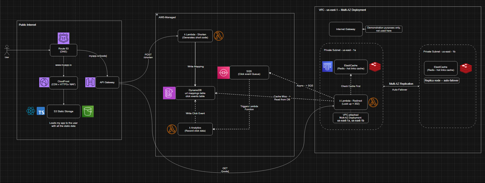

<div align="center">

# SHR.T

**A production-grade URL shortener, architected for scale — built serverless on AWS.**


</div>

---

## Overview

SHR.T shortens long URLs into compact, shareable links — but it's built the way you'd architect a system meant to handle millions of users, not a weekend toy. Multi-AZ high availability, async event-driven analytics, cache-aside caching, and defense against SSRF attacks are all designed in from day one.

This project is being built and documented end-to-end, from system design through production deployment, as a hands-on deep dive into system design, cloud architecture, and infrastructure.

<div align="center">
  
</div>

---

## Architecture

<div align="center">
  
</div>

**Highlights:**
- Fully serverless compute via AWS Lambda (Java 21 + Spring Boot 3)
- Multi-AZ ElastiCache (Redis) with auto-failover for sub-millisecond redirect lookups
- Async, event-driven click analytics via SQS — redirects never wait on tracking
- VPC scoped down to exactly what needs network isolation, nothing more
- SSRF-protected input validation, least-privilege IAM, CORS locked to a single origin

Full design rationale — including why 302 over 301, why cache-aside over write-through, and why DynamoDB over a relational store — is documented in [`PROJECT_SPEC.md`](./PROJECT_SPEC.md).

---

## Tech Stack

| Layer | Technology |
|---|---|
| **Backend** | Java 21, Spring Boot 3, Gradle |
| **Frontend** | React 18, TypeScript, Vite, Tailwind CSS, shadcn/ui |
| **Database** | DynamoDB (URL mappings + click events) |
| **Cache** | ElastiCache (Redis), Multi-AZ |
| **Messaging** | SQS (async analytics pipeline) |
| **Compute** | AWS Lambda |
| **Networking** | API Gateway, CloudFront, Route 53, VPC |
| **IaC** | Terraform |
| **CI/CD** | GitHub Actions |

---

## API

<details>
<summary><strong>POST /shorten</strong> — create a short link</summary>

**Request:**
```json
{
  "long_url": "https://www.amazon.com/some/very/long/product/link"
}
```

**Response — 201 Created:**
```json
{
  "short_code": "x7k2p",
  "short_url": "https://shrt.link/x7k2p",
  "long_url": "https://www.amazon.com/some/very/long/product/link",
  "created_at": "2026-07-05T12:00:00Z",
  "expires_at": null
}
```

</details>

<details>
<summary><strong>GET /{code}</strong> — resolve and redirect</summary>

Returns `302 Found` with a `Location` header pointing to the original URL. Uses 302 (not 301) intentionally — see the spec for why.

`404 Not Found` if the code doesn't exist.

</details>

---

## Project Status

- [x] System design & architecture diagram
- [x] Backend: data models, repositories, services, controllers
- [x] Backend: SQS async analytics pipeline
- [x] Backend: SSRF protection, centralized error handling
- [ ] Unit tests *(in progress)*
- [ ] CI/CD pipeline (GitHub Actions)
- [ ] Infrastructure as Code (Terraform)
- [ ] AWS deployment
- [ ] Frontend implementation
- [ ] End-to-end live demo

Following along? The full build log — every design decision, every AWS concept learned along the way — is in [`PROJECT_SPEC.md`](./PROJECT_SPEC.md).

---

## Getting Started (Local Development)

> ⚠️ Not yet deployable end-to-end — backend is complete, infrastructure and frontend are in progress.

```bash
# Clone the repo
git clone https://github.com/szargo5329/url-shortener.git
cd url-shortener/backend

# Build and run tests
./gradlew clean test

# Run locally (requires local Redis + AWS credentials configured)
./gradlew bootRun
```

---

## License

MIT

