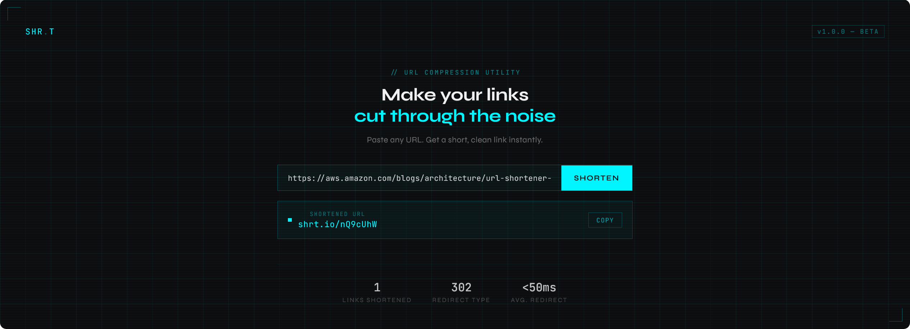
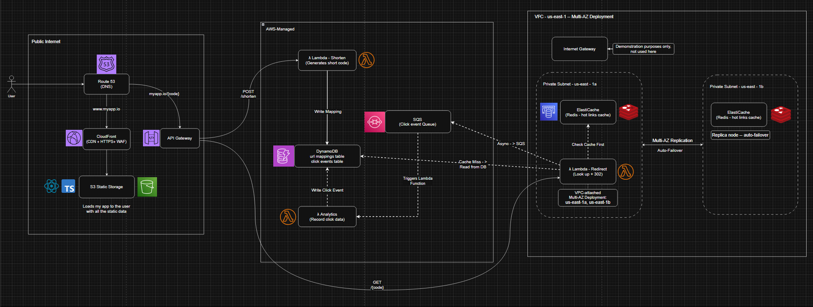

<div align="center">

# SHR.T

**A production-grade URL shortener, architected for scale — built serverless on AWS.**


</div>

---

## Overview

SHR.T shortens long URLs into compact, shareable links — architected the way you'd design a system meant to handle millions of users, not a weekend toy. Multi-AZ high availability, async event-driven analytics, cache-aside caching, and defense against SSRF attacks are all built in from day one.

**The entire product is live right now** — frontend, backend, and every piece of AWS infrastructure between them, all provisioned via Terraform and deployed through a fully automated CI/CD pipeline authenticated via OIDC federation.

<div align="center">
  
</div>

---

## Architecture

<div align="center">
  
</div>

**Highlights:**
- Fully serverless compute via AWS Lambda (Java 21 + Spring Boot 3)
- Multi-AZ ElastiCache (Redis) with auto-failover for sub-millisecond redirect lookups
- Async, event-driven click analytics via SQS — redirects never wait on tracking
- VPC scoped down to exactly what needs network isolation, with VPC Endpoints (not a NAT Gateway) so the VPC-attached Lambda can still reach DynamoDB and SQS
- SSRF-protected input validation, least-privilege IAM, CORS locked to a single origin — including a real CORS preflight gap found and fixed only after deploying to the live CloudFront domain
- React + TypeScript frontend, styled to a lo-fi cyberpunk aesthetic, served from S3 via CloudFront
- Every AWS resource — nine categories in total — provisioned via Terraform, zero manual resource creation
- CI/CD deploys both backend (Lambda) and frontend (S3 + CloudFront) via GitHub OIDC federation — no static AWS credentials in CI/CD, ever
- CloudWatch alarms (Lambda errors, API Gateway 5xx, DynamoDB throttling) + SNS email alerts, plus an AWS Budget alert

Full design rationale — including every real gap caught and fixed along the way (IAM permissions, VPC networking, Lambda packaging, OIDC trust policies, a CORS preflight route only discovered on real deployment) — is documented in [`PROJECT_SPEC.md`](./PROJECT_SPEC.md).

---

## Tech Stack

| Layer | Technology |
|---|---|
| **Backend** | Java 21, Spring Boot 3, Gradle (Shadow plugin for Lambda packaging) |
| **Frontend** | React 18, TypeScript, Vite, Tailwind CSS, shadcn/ui |
| **Database** | DynamoDB (URL mappings + click events) |
| **Cache** | ElastiCache (Redis), Multi-AZ with auto-failover |
| **Messaging** | SQS (async analytics pipeline) |
| **Compute** | AWS Lambda (3 functions: shorten, redirect, analytics) |
| **Networking** | API Gateway (HTTP API), CloudFront, VPC, VPC Endpoints |
| **IaC** | Terraform — all 9 AWS resource categories |
| **CI/CD** | GitHub Actions, OIDC federation (no static credentials), backend + frontend pipelines |
| **Monitoring** | CloudWatch Alarms + SNS, AWS Budget alerts |

---

## Live

The full product — frontend and backend — is deployed and publicly reachable right now:

- **App:** served via CloudFront (custom domain pending, see Project Status)
- **API:** `POST /shorten` and `GET /{code}`, both live on API Gateway

Every layer is real: real DynamoDB writes, real Multi-AZ Redis caching, real async click analytics via SQS, real Lambda execution behind a real CDN.

---

## API

<details>
<summary><strong>POST /shorten</strong> — create a short link</summary>

**Request:**
```json
{
  "long_url": "https://www.amazon.com/some/very/long/product/link"
}
```

**Response — 201 Created:**
```json
{
  "short_code": "x7k2p",
  "short_url": "https://shrt.link/x7k2p",
  "long_url": "https://www.amazon.com/some/very/long/product/link",
  "created_at": "2026-07-12T12:00:00Z",
  "expires_at": "2026-07-19T12:00:00Z"
}
```

Links expire 7 days after creation (fixed MVP default — see spec for rationale).

</details>

<details>
<summary><strong>GET /{code}</strong> — resolve and redirect</summary>

Returns `302 Found` with a `Location` header pointing to the original URL. Uses 302 (not 301) intentionally — see the spec for why.

`404 Not Found` if the code doesn't exist or has expired.

</details>

---

## Project Status

- [x] System design & architecture diagram
- [x] Backend: full implementation, SQS async analytics, SSRF protection, fixed 7-day expiration
- [x] Unit tests — 6 test classes, 44 tests, zero real AWS/Redis dependencies
- [x] Infrastructure as Code — all 9 AWS resource categories provisioned via Terraform
- [x] CI/CD — backend and frontend pipelines, OIDC federation, auto-deploy on push to `main`
- [x] Monitoring — CloudWatch alarms + SNS, AWS Budget alerts
- [x] Security audit — CORS, DynamoDB resource policies, IAM least-privilege review
- [x] Frontend — built, styled, deployed, fully wired to the real live API
- [x] **End-to-end verification — complete, live, and confirmed working on the real deployed URL**
- [ ] Custom domain (Route 53 + ACM) *(intentionally deferred)*
- [ ] IAM policy tightening — dev user FullAccess → least-privilege *(its own dedicated session)*

The full build log — every design decision, every AWS concept learned, every real gap caught and fixed along the way — is in [`PROJECT_SPEC.md`](./PROJECT_SPEC.md).

---

## Getting Started (Local Development)

```bash
# Clone the repo
git clone https://github.com/szargo5329/url-shortener.git
cd url-shortener

# Backend
cd backend
./gradlew clean test
./gradlew shadowJar

# Frontend
cd ../frontend
npm install
npm run dev
```

Infrastructure is managed via Terraform in `infrastructure/` — see [`PROJECT_SPEC.md`](./PROJECT_SPEC.md) Section 19 for the full setup and deployment process.

---

## License

MIT
